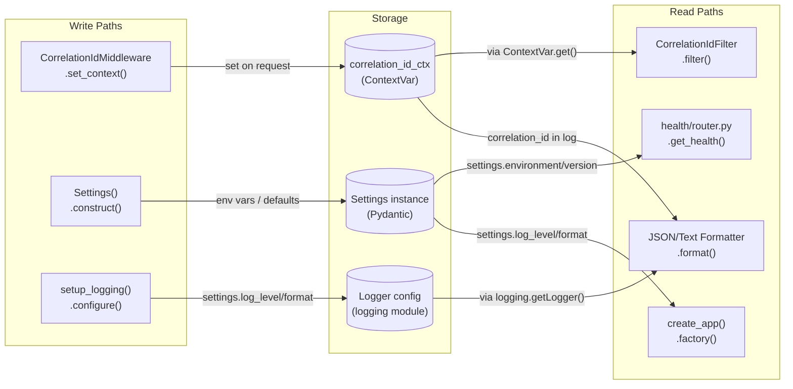
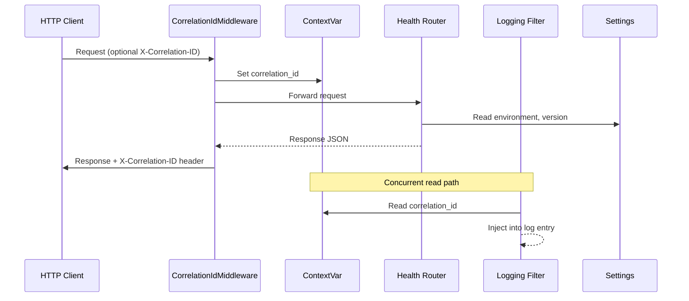
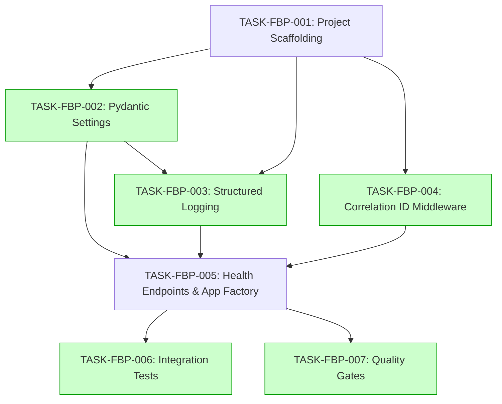

# Implementation Guide: FastAPI Base Project

## Architecture Overview

This feature implements a lean, production-structured FastAPI application with zero external dependencies. The architecture follows the template's feature-based organization with three layers: core infrastructure, feature modules, and the app factory.

## Data Flow: Read/Write Paths



All write paths have corresponding read paths. No disconnections detected.

## Integration Contracts



## Section 4: Integration Contracts

### Contract: CORRELATION_ID
- **Producer task:** TASK-FBP-004 (Correlation ID middleware)
- **Consumer task(s):** TASK-FBP-003 (Structured logging)
- **Artifact type:** Python ContextVar (`contextvars.ContextVar[str | None]`)
- **Format constraint:** `correlation_id_ctx` must be a `ContextVar[str | None]` importable from `src.core.middleware`. The logging filter reads it via `.get(None)` — returns the current correlation ID string or None.
- **Validation method:** Import `correlation_id_ctx` from `src.core.middleware`, verify it is a `ContextVar` instance, verify `.get(None)` returns None when no request is active.

### Contract: SETTINGS
- **Producer task:** TASK-FBP-002 (Pydantic settings)
- **Consumer task(s):** TASK-FBP-005 (Health endpoints / app factory), TASK-FBP-003 (Logging setup)
- **Artifact type:** Python class instance (`Settings`)
- **Format constraint:** `Settings` must be importable from `src.core.config` with fields: `environment` (Literal), `app_version` (str), `log_level` (Literal), `log_format` (Literal), `api_prefix` (str), `app_name` (str). Constructor must work with no arguments (defaults).
- **Validation method:** Instantiate `Settings()` with no arguments, verify all required fields exist and have valid default values.

### Contract: LOGGING_SETUP
- **Producer task:** TASK-FBP-003 (Structured logging)
- **Consumer task(s):** TASK-FBP-005 (App factory)
- **Artifact type:** Python function
- **Format constraint:** `setup_logging(settings: Settings) -> None` importable from `src.core.logging`. Must be called before route handlers process requests.
- **Validation method:** Import `setup_logging`, call with a `Settings()` instance, verify no exception raised.

### Contract: CORRELATION_ID_MIDDLEWARE
- **Producer task:** TASK-FBP-004 (Correlation ID middleware)
- **Consumer task(s):** TASK-FBP-005 (App factory)
- **Artifact type:** Python middleware class
- **Format constraint:** `CorrelationIdMiddleware` importable from `src.core.middleware`. Added to app via `app.add_middleware(CorrelationIdMiddleware)`.
- **Validation method:** Import class, verify it is callable/instantiable.

## Task Dependencies



_Tasks with green background can run in parallel within their wave._

## Execution Strategy

### Wave 1: Foundation (Sequential)
| Task | Mode | Description |
|------|------|-------------|
| TASK-FBP-001 | task-work | Project scaffolding — directory structure, pyproject.toml, requirements |

### Wave 2: Core Infrastructure (Parallel)
| Task | Mode | Description |
|------|------|-------------|
| TASK-FBP-002 | task-work | Pydantic Settings class with validation |
| TASK-FBP-004 | task-work | Correlation ID middleware with ContextVar |

Then (depends on TASK-FBP-002):
| Task | Mode | Description |
|------|------|-------------|
| TASK-FBP-003 | task-work | Structured logging (needs Settings + ContextVar) |

### Wave 3: Assembly (Sequential)
| Task | Mode | Description |
|------|------|-------------|
| TASK-FBP-005 | task-work | Health endpoints + app factory (assembles all core components) |

### Wave 4: Verification (Parallel)
| Task | Mode | Description |
|------|------|-------------|
| TASK-FBP-006 | task-work | Integration tests for all 28 BDD scenarios |
| TASK-FBP-007 | direct | Quality gates: ruff, mypy, pytest-cov configuration |

## Target Directory Structure

```
src/
├── __init__.py
├── main.py                  # create_app() factory + module-level app instance
├── health/
│   ├── __init__.py
│   ├── router.py            # GET /health, /live, /ready
│   └── schemas.py           # HealthResponse, LiveResponse, ReadyResponse
└── core/
    ├── __init__.py
    ├── config.py             # Settings(BaseSettings)
    ├── logging.py            # setup_logging(), JSON/Text formatters, CorrelationIdFilter
    └── middleware.py         # CorrelationIdMiddleware, correlation_id_ctx ContextVar
tests/
├── conftest.py              # AsyncClient fixture, log capture fixture
├── test_app.py              # App factory tests
├── health/
│   └── test_router.py       # Health endpoint integration tests
└── core/
    ├── test_config.py        # Settings validation tests
    ├── test_logging.py       # Log format tests
    └── test_middleware.py    # Correlation ID tests
pyproject.toml               # All tool configuration
requirements/
├── base.txt                 # Production dependencies
└── dev.txt                  # Development dependencies
.env.example                 # Documented environment variables
```

## Key Design Decisions

1. **App factory over module-level app**: `create_app(settings=None)` allows tests to inject custom Settings without environment patching. Module-level `app = create_app()` provided for `uvicorn src.main:app`.

2. **ContextVar over request.state**: ContextVar is async-safe, accessible from logging filters without passing the request object, and automatically isolated per async task.

3. **Literal types over Enum**: Pydantic Literal["development", "staging", "production"] provides validation at construction time with less boilerplate than Enum classes.

4. **Raw ASGI middleware consideration**: While BaseHTTPMiddleware is simpler, raw ASGI middleware has better ContextVar support. Implementation should evaluate both and choose based on ContextVar reliability.

5. **No database layers**: The spec requires zero external dependencies. Database, Redis, and ORM layers will be added as separate features when needed.
